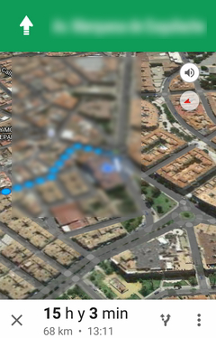

# PuntoGPSQR

## Descripción de la aplicación

La aplicación PuntoGPSQR es una aplicación sencilla que hace uso de la cárama, reconocimiento de QRs y el GPS.

Primeramente, el usuario deberá sacarle una foto a un QR que disponga de una latitud y una longitud de una localización.

Si el QR dispone de tal información, se procesará automaticámente y se lanzará *Google Navigation* para realización una navegación GPS hacia el punto que indicaba el QR.

Además, mientras se muestra indicaciones para relizar el recorrido, se va guardando periódicamente la localización del usuario. Así, cuando el recorrido termina, se muestra en un mapa el recorrido realizado por el usuario.

## Implementación

*Nota*: todo el código esta bastante documentado. La siguiente explicación es una breve descripción a muy alto nivel de como se ha implementado la aplicación.

La primera parte de la aplicación es la correspondiente a la actividad *MainActivity*.

### MainActivity

Para lanzar la toma de la foto, el usuario debe pulsar en la imagen de la cámara que hay en la pantalla. Para ello basta añadir un método *setOnClickListener()* a dicha imagen.

Este método llama a *tomarFoto()*, que mediante el *Intent* *MediaStore.ACTION_IMAGE_CAPTURE* se puede realizar una foto de forma muy sencilla, ya que llama a la aplicación de la cámara del teléfono. En *onActivityResult()*, se almacena la foto tomada en un objeto *Bitmap* que será necesario para el detector de QR.

El detector de QR que hemos usado es el que proporciona la API de *MobileVision* de *Google Play Services* , luego el usuario no tendrá que instalar aplicaciones adicionales. En [Bibliografía](https://github.com/ranea/AppsAndroid/tree/master/PuntoGPSQR#bibliografía) se encuentra de forma detallada como se añade esta librería.

Este detector lo inicializamos en *onCreate()* mediate un objeto *BarcodeDetector*. Así, volviendo a *onActivityResult()*, creamos un *Frame* asociado a la foto y le pasamos el *Frame* al detector QR usando la función *detect()*. Esta función devuelve un *SparseArray<Barcode>* y la primera componente de dicho array es el mensaje obtenido del QR. Obtenido el mensaje, lo validamos usando *validarMensaje()*, esto es, comprobamos que el mensaje embebido en el QR es de la forma `LATITUD_<lat>_LONGITUD_<lng>`. En caso afirmativo iniciamos *NavegacionActivity* mediante un intent para empezar la navegación GPS y la toma de datos mediante el GPS.

### NavegacionActivity

Esta activity lanza, según las coordenadas que le llegan desde *MainActivity*, *Google Navigation* para llevarnos al punto deseado. También lanza el *LocalizacionService*, que es un servicio que toma datos de localización GPS cada 10 segundos y los va acumulando. Al volver de la navegación, con dichos puntos se dibuja una polilínea indicando la ruta tomada por el usuario en un objeto de tipo *GoogleMap*, que no es más que un mapa de *Google Maps*.

### LocalizacionService

Este servicio permite tomar datos de localización GPS cada 10 segundos, pasándoselo a la *NavegacionActivity* a través de un objeto *EventBus*.

La localización se realiza a través de la API de *Google Play Services*, para la cual debemos crear el objeto *mGoogleApiClient* y conectarlo a los servicios de Google con *connect()*. Debemos crear la petición de localización, lo cual encapsulamos en *crearPeticionLocalizacion()* para ajustar sus parámetros. Por último, sólo debemos pedir localizaciones, eso se hace con *LocationServices.FusedLocationApi.requestLocationUpdates*.

Al recibir una localización en *onLocationChanged* creamos el evento *EventoLocalizacion* que mandaremos a la activity a través del método *post()* de *EventBus*.

### EventoLocalizacion

Aquí se define el objeto que le vamos a pasar a nuestra *NavigationActivity*. Será un objeto con un *LatLng* para modelar la localización y un *String* que definirá la hora de la actualización.

## Bibliografía

### Detección del QR

[Detección de QR con la API de Mobile Vision](https://search-codelabs.appspot.com/codelabs/bar-codes#1)

[Información sobre Mobile Vision API](https://developers.google.com/vision/introduction)

[SparseIntArray](http://developer.android.com/intl/es/reference/android/util/SparseIntArray.html)

### Cámara

[Uso de la app de la cámara I](http://developer.android.com/intl/es/guide/topics/media/camera.html#intents)

[Uso de la app de la cámara II](http://developer.android.com/intl/es/guide/topics/media/camera.html#intent-receive)

### Localización

[Guía para tener localización en tu app](http://developer.android.com/intl/es/training/location/index.html)

[Google Maps en Android](https://developers.google.com/maps/documentation/android-api/map)

[Servicios en Android](http://developer.android.com/intl/es/guide/components/services.html)

[EventBus](http://greenrobot.org/eventbus/)

## Licencias externas

Las imágenes utilizadas pertenece al conjunto de [Material icons](https://design.google.com/icons/) de Google. Disponen de licencia Creative Common Attribution 4.0 International License.

Para crear los iconos de la aplicación en el launcher, se ha utilizado la herramienta [Launcher Icon Generator](https://romannurik.github.io/AndroidAssetStudio/icons-launcher.html) de Roman Nurik, con licencia Apache.
