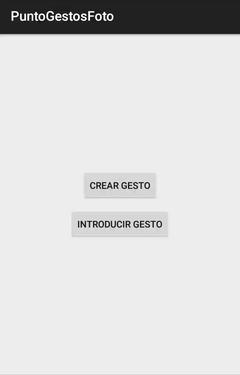
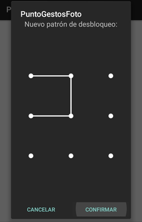
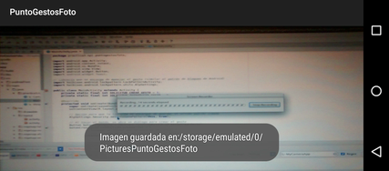

# PuntoGestosFoto

## Descripción de la aplicación

La aplicación PuntoGestosFoto es una aplicación sencilla para Android que hace uso de reconocimiento de gestos para lanzar una foto automáticamente.

En primer lugar, el usuario deberá crear un gesto. El gesto es análogo al patrón que usa Android en el bloqueo de pantalla y el procedimiento para crearlo es similar. Para el usuario será fácil pues está ya familiarizado.

Posteriormente, si introduce el gesto que habría creado, se tomará una foto automáticamente a los tres segundos. Si introduce otro gesto no se tomará la foto.

## Implementación

*Nota*: todo el código esta bastante documentado. La siguiente explicación es una breve descripción a muy alto nivel de como se ha implementado la aplicación.

La funcionalidad de esta app recae en dos actividades. La actividad *MainActivity* se encarga del manejo y procesamiento del gesto y la actividad *VistaPreviaCamara* se encarga de la toma de la foto y la previsualización de la misma.

### MainActivity

Para el manejo del gesto se ha utilizado la librería [android-lockpattern](https://bitbucket.org/haibison/android-lockpattern). Para poder utilizarla es necesario introducirla en los *build.gradle* y dentro de MainActivity hacer un *import*. En el apartado [Bibliografía](https://github.com/ranea/AppsAndroid/tree/master/PuntoGestosFoto#bibliografía) se encuentra este proceso más detallado.

Para crear el gesto se lanza un *LockPatternActivity.IntentBuilder* con la opción *.newPatternCreator()*. Para introducir un gesto y compararlo con el creado se lanza un *LockPatternActivity.IntentBuilder* con la opción *.newPatternComparator()* . Con *AlpSettings.Security.setAutoSavePattern()* le decimos a la librería que se encargue del almacenamiento del patrón en las *SharedPreferences*.

Por último, los resultados de los dos *IntentBuilder* lanzados se deben manejar en *onActivityResult()*. En el caso de la creación del patrón no es necesario hacer nada y en el segundo caso lanzamos un *Intent* a *CamaraActivity*  (sólo si coincide el gesto introducido con el guardado).

### CamaraActivity

Esta actividad se encarga de inicializar la vista previa de la cámara, de tomar una foto a los tres segundos de forma automática y de almacenar dicha foto.

El código de la creación de la vista previa está en *VistaPreviaCamara*. Este código es muy simple y consta de: la creación de la superficie con *getHolder()* que alojará la vista previa, asociar la superficie con la cámara con *setPreviewDisplay()* e iniciar la cámara con *startPreview()*.

La inicialización de la vista previa se llama desde el *onCreate()* de *CamaraActivity*. Después se crea un *Handler* que ejecutará la toma de la foto a los 3 segundos con *postDelayed(). En particular, se toma la foto con *takePicture()* y se muestra al usuario el directorio donde se guarda la foto con un *Toast*.

Para guardar la foto como *.jpg* se utilizan los métodos *onPictureTaken()* (que se llama automáticamente al echar la foto) y *obtenerArchivoMultimediaDeSalida()* que se encarga de crear el archivo donde se alojará la foto.

Por último hemos desactivado el botón de atrás sobreescribiendo el método *onBackPressed()* para evitar que la aplicación

## Bibliografía

### Android básico

[Tutorial para empezar en Android](http://developer.android.com/training/basics/firstapp/index.html)

[Componentes fundamentales](http://developer.android.com/intl/es/guide/components/fundamentals.html)

### Android-lockpattern

[Uso de la librería android-lockpattern](https://bitbucket.org/haibison/android-lockpattern/wiki/Quick-Use)

### Cámara

[Tutorial de la cámara](http://developer.android.com/intl/es/guide/topics/media/camera.html#custom-camera)

[Permisos para escribir en la SD](http://developer.android.com/intl/es/guide/topics/data/data-storage.html#filesExternal)

### Otros

[Hacer una pausa en una App](http://stackoverflow.com/questions/1520887/how-to-pause-sleep-thread-or-process-in-android)

[Desactivar el botón Atrás](http://stackoverflow.com/questions/4779954/disable-back-button-in-android)

[Acceder a un recurso en el código](http://developer.android.com/intl/es/guide/topics/resources/accessing-resources.html#ResourcesFromCode)

## Licencias externas

La librería [android-lockpattern](https://bitbucket.org/haibison/android-lockpattern) que se utilizó para el manejo de los gestos tiene licencia Apache License v2.0.

Las imágenes utilizadas pertenece al conjunto de [Material icons](https://design.google.com/icons/) de Google. Disponen de licencia Creative Common Attribution 4.0 International License.

Para crear los iconos de la aplicación en el launcher, se ha utilizado la herramienta [Launcher Icon Generator](https://romannurik.github.io/AndroidAssetStudio/icons-launcher.html) de Roman Nurik, con licencia Apache.
