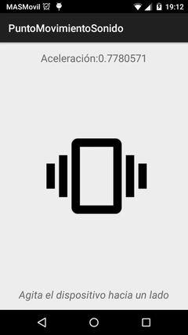
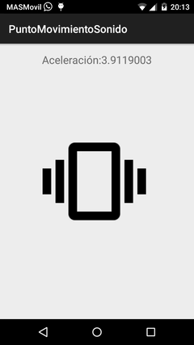

# PuntoMovimientoSonido

## Descripción de la aplicación

La aplicación PuntoMovimientoSonido es una aplicación sencilla para Android que hace uso del acelerómetro para reproducir un sonido.

Una vez iniciada la app, siempre que el usuario desplace su dispositivo horizontalmente con una cierta velocidad, se reproducirá un sonido y el icono del móvil en la pantalla se agitará levemente.

## Implementación

*Nota*: todo el código esta bastante documentado. La siguiente explicación es una breve descripción a muy alto nivel de como se ha implementado la aplicación.

Esta app solo dispone de una actividad, *MainActivity*.

### MainActivity

Para poder reproducir el sonido, en el método *OnCreate()*  se crea un objeto de tipo *SoundPool* que será el encargado de manejar el archivo mp3 almacenado en *res/raw/*. Para poder crear este objeto hay que pasarle como argumento otro de tipo *AudioAttributes*, que lo creamos previamente. También creamos en *OnCreate()* la animación de mover la imagen. La reproducción del sonido y de la imagen se realiza en *reproducirSonidoYAnimacion()* que se llama en la clase *AcelerometroData*.

### AcelerometroData

Al igual que en la app [BrujulaVoz](https://github.com/ranea/AppsAndroid/tree/master/BrujulaVoz) disponíamos de una clase *BrujulaData* que se encargaba de manejar los sensores, en este aplicación disponemos AcelerometroData que se encarga de manejar únicamente el acelerómetro. La similitud en la estructura con *BrujulaData* es muy alta y por ello solo explicaremos donde hay código nuevo: en el método *onSensorChanged()*.

El objetivo en *onSensorChanged()* es conseguir la aceleración lineal del dispositivo en el eje X (cuando se desplaza horizontalmente respecto al usuario). Para ello previamente hay que isolar la fuerza de la gravedad con un filtro paso-bajo tomando como umbral el recomendado por la API de Android. Así, para obtener la aceleración le restamos a los datos obtenidos por el sensor la gravedad ya calculada. Si esta aceleración supera una aceleración mínima, llamamos a *reproducirSonidoYAnimacion()* .

## Bibliografía

### Android básico

[Tutorial para empezar en Android](http://developer.android.com/training/basics/firstapp/index.html)

[Componentes fundamentales](http://developer.android.com/intl/es/guide/components/fundamentals.html)

### Sonido

[Tutorial SoundPool](http://www.northborder-software.com/getting_started_part26.html)

[Información SoundPool](http://developer.android.com/intl/es/reference/android/media/SoundPool.html)

### Acelerómetro

[Usar el acelerómetro](http://developer.android.com/intl/es/guide/topics/sensors/sensors_motion.html#sensors-motion-accel)

[Sistema de coordenadas del sensor](http://developer.android.com/intl/es/guide/topics/sensors/sensors_overview.html#sensors-coords)

### Animación

[Ejemplo de TranslateAnimation](http://www.javasrilankansupport.com/2013/06/how-to-move-an-image-from-left-to-right-and-right-to-left-in-android.html)

## Licencias externas

El sonido utilizado al agitar el dispositivo, [Mario Coin Sound](http://www.orangefreesounds.com/mario-coin-sound/), tiene licencia Creative Common Attribution-NonCommercial 4.0 International License.

Las imágenes utilizadas pertenece al conjunto de [Material icons](https://design.google.com/icons/) de Google. Disponen de licencia Creative Common Attribution 4.0 International License.

Para crear los iconos de la aplicación en el launcher, se ha utilizado la herramienta [Launcher Icon Generator](https://romannurik.github.io/AndroidAssetStudio/icons-launcher.html) de Roman Nurik, con licencia Apache.
