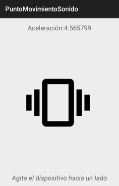

# Aplicaciones Android

Conjunto de aplicaciones Android de diversas funcionalidades.

 - [BrujulaVoz](BrujulaVoz)
 - [PuntoGPSQR](PuntoGPSQR)
 - [PuntoGestosFoto](PuntoGestosFoto)
 - [PuntoMovimientoSonido](PuntoMovimientoSonido)
 - [NPISaltitos](NPISaltitos)

Capturas de pantalla de las aplicaciones.

# TO DO

Común a todas las app

* [ ] Pasar todos los String al fichero xml. (tb de los layout)
* [ ] Añadir las snapshot y el gif.
* [ ] Especificar el tema utilizado y el cambio de iconos
* [x] Quitar enlaces.md
* [ ] Corregir documentación del código
* [x] Picar 5º app
* [ ] Sacar del GitHub todos los tutorial.pdf, tutorial.md y los mytemplate.latex

