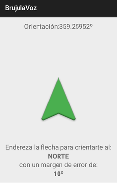

# Aplicaciones Android

Conjunto de aplicaciones Android de diversas funcionalidades.

 - [BrujulaVoz](https://github.com/ranea/AppsAndroid/tree/master/BrujulaVoz)
 - [PuntoGPSQR](https://github.com/ranea/AppsAndroid/tree/master/PuntoGPSQR)
 - [PuntoGestosFoto](https://github.com/ranea/AppsAndroid/tree/master/PuntoGestosFoto)
 - [PuntoMovimientoSonido](https://github.com/ranea/AppsAndroid/tree/master/PuntoMovimientoSonido)
 - [NPISaltitos](https://github.com/ranea/AppsAndroid/tree/master/NPISaltitos)

Ejemplo de PuntosGestosFoto:

# TO DO

Común a todas las app

* [ ] Pasar todos los String al fichero xml. (tb de los layout)
* [ ] Añadir las snapshot y el gif.
* [ ] Especificar el tema utilizado y el cambio de iconos
* [x] Quitar enlaces.md
* [ ] Corregir documentación del código

* [x] Picar 5º app

# Guía de estilo

- Todos los nombres de las variables y funciones en *español* (a no ser que sea uno propio de Android/java)
- Para comentarios largos (3+ lineas, usar):
/*
 *
 */
